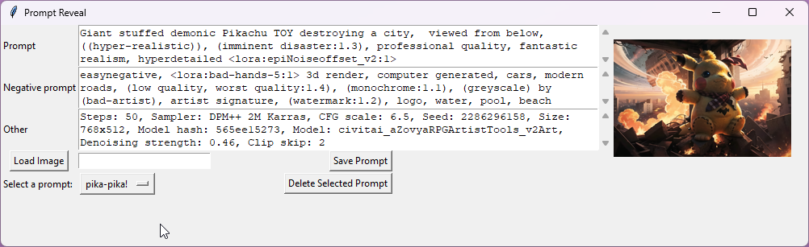
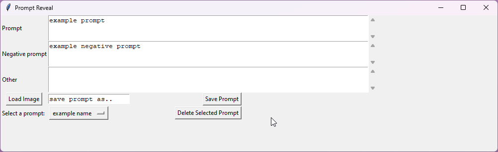

<h2>Prompt Reveal</h2>

Prompt Reveal is a user interface created with Python, tkinter & PILLOW that allows you to manage your AUTO1111 / Vlad styles.csv file, making it easier to work with AI-generated prompts. It is wrapped by pyinstaller to create a single file for ease of use.

<h2>UI</h2>
<h4> View a prompt from an image </h4>

    Check if there is prompt meta-data on an image

<h4> Save, load and delete prompts from style.csv </h4>
    

    Save a prompt by adding a name in the text field next to the "Save Prompt" button
    Add and delete styles from your styles.csv file

<h2>Installation and Usage</h2>
<i><b>Package created using <a href="https://github.com/pyinstaller">pyinstaller</a></i></b>

1. Choose <a href="https://github.com/JAMadison/Prompt_Reveal/blob/main/Prompt_Reveal_v1_01.zip">zip file</a>, <a href="https://github.com/JAMadison/Prompt_Reveal/blob/main/Prompt_Reveal_v1_01.exe">exe</a> or <a href="https://github.com/JAMadison/Prompt_Reveal/blob/main/main.py">main.py</a> <i>A guide and instructions will be coming soon for running the program in your own python enviroment.</i>

2. Run the .exe in your <i><b>AUTO1111</b></i> root folder, where the styles.csv file is located. If you don't have a styles.csv file in the same directory as the Prompt Reveal executable, the program will create a new one for you when you run it for the first time.

3. Right click the .exe and send to desktop as a shortcut for easy access

#Feedback

We hope that you find Prompt Reveal helpful in managing your styles.csv file. If you have any feedback or suggestions for how we can improve the program, please don't hesitate to let us know!
